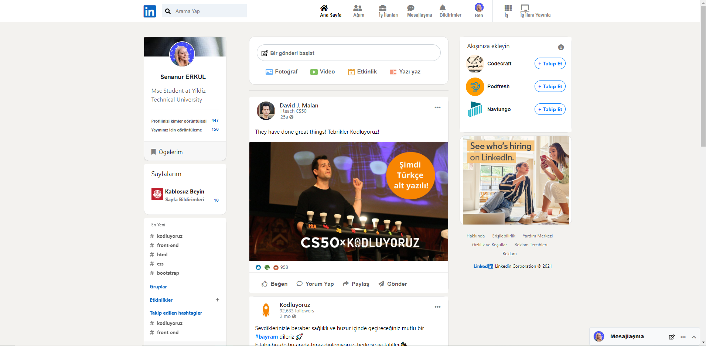

# LinkedIn-Clone
Simple HTML LinkedIn clone made with Bootstrap.



## Installation
First, clone the project.
```
git clone https://github.com/erkulsenanur/LinkedIn-Clone.git
```

## Usage
After cloning the project, open it in Visual Studio Code.

For Linux:
```
cd LinkedIn-Clone
code .
```

## Contributing
Pull requests are accepted. For major changes, please open a thread to discuss what you want to change.

## License
[MIT](https://choosealicense.com/licenses/mit/)